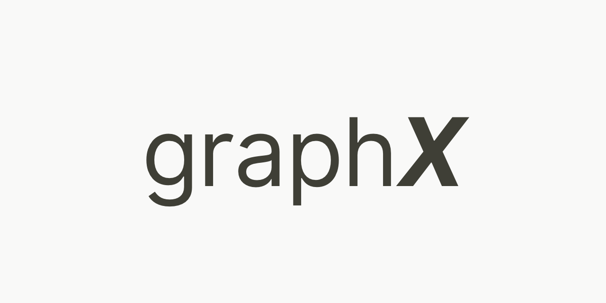
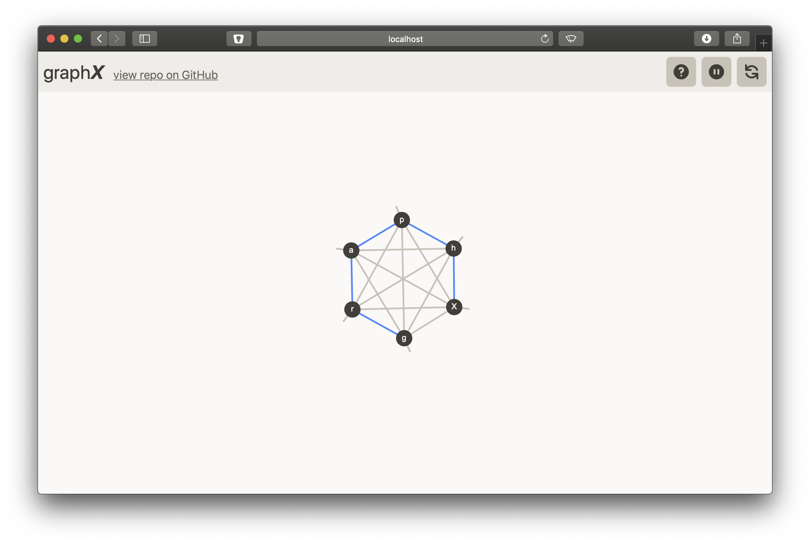

  
<p>
  
</p>
  
A graph theory library that isn't *super* gross.
  
  
- [Installing](#installing )
  - [Manual](#manual )
  - [Through Git](#through-git )
- [Quick Start](#quick-start )
  - [Webserver](#webserver )
  - [Jupyter Notebook](#jupyter-notebook )
- [Understanding the graphX web interface](#understanding-the-graphx-web-interface )
  - [The Header](#the-header )
  - [The Graph Canvas](#the-graph-canvas )
- [The `Graph` Object](#the-graph-object )
- [Methods](#methods )
  - [Graph Methods:](#graph-methods )
      - [`run_web()`](#run_web )
      - [`add_node(n)`](#add_noden )
      - [`add_nodes(n_list)`](#add_nodesn_list )
      - [`get_nodes()`](#get_nodes )
      - [`get_node(val)`](#get_nodeval )
      - [`del_node(val)`](#del_nodeval )
      - [`add_edge(source, target)`](#add_edgesource-target )
      - [`del_edge(source, target)`](#del_edgesource-target )
      - [`traverse_edge(source, target)`](#traverse_edgesource-target )
      - [`pause(time)`](#pausetime )
      - [`clear()`](#clear )
  - [Node Methods:](#node-methods )
      - [`set_attr(attr, value)`](#set_attrattr-value )
      - [`get_attr(attr)`](#get_attrattr )
      - [`get_size()`](#get_size )
- [Contributing](#contributing )
  - [Found a bug?](#found-a-bug )
  - [Had an idea for a feature?](#had-an-idea-for-a-feature )
  - [Need some help figuring out what's going on?](#need-some-help-figuring-out-whats-going-on )
  - [Want to make a Pull Request (PR)?](#want-to-make-a-pull-request-pr )
- [Previous works](#previous-works )
  
##  Installing
  
  
**graphX does not work with Python 2. Make sure you have an up to date version of Python installed.**
  
###  Manual
  
Download the most recent version of graphX from the top of this page. [Download graphX](https://github.com/ehne/graphX/archive/main.zip )
  
Rename it to just `graphX` and place it in the same folder as your code that will be using it.
  
###  Through Git
  
run the following in your working directory.
```bash
$ git clone https://github.com/ehne/graphX.git
```
  
Installing through git means that it is easier for you to get updates. Simply by running `git pull` inside of the graphX directory graphX will update to the latest version.
  
After you have installed graphX, you can import `graphX` from your python files.
  
> graphX relies on [AlgorithmX](https://algrx.github.io ) for visualisation. So you might have to install that as well.
  
##  Quick Start
  
There are two ways to get up and running with graphX: via a webserver, or by using jupyter notebooks. They both have their pros and cons.
  
###  Webserver
  
```python
import graphX as gx
  
g = gx.Graph()
  
@g.run_web
def code():
    # put all the code you want here, will be run everytime someone presses play/reload.
    g.add_node("A")
    g.add_node("B")
  
code()
```
  
###  Jupyter Notebook
  
```py
import graphX as gx
g = gx.Graph(is_jupyter=True)
  
# run any methods you want and the graph will auto-update.
```
  
##  Understanding the graphX web interface
  
  

  
The web interface contains two parts: the header and the graph canvas.
  
###  The Header
  
This is the bar at the top of the page, it contains features for controlling the running of your graph code.
  

  
The header controls. From left to right: help, play/pause, reset.
  
- The **help** button opens up the graphX documentation in a new tab. (the graphX docs are just the document you are reading).
- The **play/pause** button starts your graph code and pauses it. It toggles between the two states.
- The **reset** button completely clears the graph canvas and resets all variables. It is the same as refreshing your browser window.
  
###  The Graph Canvas
  
This is the section where your graph renders. It takes up all of the page, except for where the header is.
  
Individual nodes can be moved around just by clicking and dragging on them. Likewise the entire graph can be moved around by clicking and dragging anywhere that isn't a node.
  
To zoom in, scroll up. And to zoom out, scroll down. You can also double click anywhere on the graph to zoom in on that point.
  
##  The `Graph` Object
  
You can create a new graph by making a new instance of the Graph object.
```py
# simplest new graph (webserver)
g = gx.Graph()
  
# using a custom port for the webserver
g = gx.Graph(port=4000) # default is 5050
  
# simplest new graph (jupyter)
g = gx.Graph(is_jupyter=True)
  
# changing the size of the jupyter widget
g = gx.Graph(width=400, height=100) # default is w=300 h=200
```
  
##  Methods
  
  
###  Graph Methods: 
  
#####  `run_web()`
  
a decorator function that starts the websever and runs your code on it.
  
```py
g = gx.Graph()
  
@g.run_web
def code():
    # code to run
  
code()
```
  
#####  `add_node(n)`
  
adds the node `n` to the graph. Ignoring duplicate nodes.
```py
g.add_node("A")
g.add_node(42) 
```
  
#####  `add_nodes(n_list)`
  
adds each element in the iterable (list or other type) `n_list` to the graph.
```py
g.add_nodes(["A","B",1,2,3]) 
g.add_ndoes("hello!") 
```
  
#####  `get_nodes()`
  
returns a list of nodes.
```py
g.add_node("A")
g.add_node("B")
g.get_nodes() # returns: [Node("A", {}), Node("B", {})]
```
  
#####  `get_node(val)`
  
returns the `Node` with that specific value (whatever `n` was when you ran `add_node(n)`).
```py
g.add_node("A")
g.get_node("A") # returns a Node object. `Node("A", {})`
```
  
#####  `del_node(val)`
  
deletes the `Node` with that specific value (whatever `n` was when you ran `add_node(n)`).
```py
g.add_node("A")
g.del_node("A")
```
  
#####  `add_edge(source, target)`
  
adds an edge between the source and target nodes.
```py
g.add_nodes("AB")
  
g.add_edge("A","B")
  
# use a different edge value:
g.add_edge("A","B", value=4) # defaults to 1
  
# set the edge to be directed.
g.add_edge("A","B", directed=True) # defaults to False
```
  
#####  `del_edge(source, target)`
  
deletes the edge between the source and target nodes.
```py
g.add_nodes("ABC")
g.add_edge("A", "B")
g.add_edge("B", "C")
  
g.del_edge("A", "B")
```
  
#####  `traverse_edge(source, target)`
  
animates traversing the edge connecting the source and target nodes.
```py
g.add_nodes("ABC")
g.add_edge("A", "B")
g.add_edge("B", "C")
  
g.traverse_edge("A", "B")
  
# use a different colour for the traversal:
g.traverse_edge("B", "C", color="#fa0") # any css colour works
```
  
#####  `pause(time)`
  
pauses the code for `time` seconds. (defaults to 1 second)
```py
g.add_node("A")
g.pause()
g.add_node("B")
```
  
#####  `clear()`
  
clears all nodes and edges from the graph.
```py
g.add_nodes("AB")
g.add_edge("A", "B")
  
g.clear()
```
  
###  Node Methods:
  
#####  `set_attr(attr, value)`
  
sets a Node's attribute to be `value`.
```py
g.add_node("A")
n = g.get_node("A")
n.set_attr("seen", False)
```
  
#####  `get_attr(attr)`
  
gets an attribute's value from a Node.
```py
g.add_node("A")
n = g.get_node("A")
n.set_attr("seen", False)
n.get_attr("seen") # returns `False`
```
  
#####  `get_size()`
  
returns the approximate width of the node. this is used internally so that all the node's text is visible against the background of the node. It might not be useful outside of this single purpose, but who knows.
  
```py
g.add_node("hi")
g.get_node("hi").get_size() # returns 9.8
```
  
##  Contributing 
  
###  Found a bug?
  
Great! Create a new [issue](https://github.com/ehne/graphX/issues ) and let me know what's going on. Please try to be as specific as possible (this includes info about browser and operating system) as it really helps speed up the bugfixing process.
  
###  Had an idea for a feature?
  
Wonderful! Just leave a message about your idea in the [ideas discussion board](https://github.com/ehne/graphX/discussions/categories/ideas ).  
  
###  Need some help figuring out what's going on?
  
That's okay, just let us know what's confusing you on the [Q&A discussion board](https://github.com/ehne/graphX/discussions/categories/q-a ) and someone will help you out shortly.
  
###  Want to make a Pull Request (PR)?
  
Good to hear that you want to help code graphX! Just fork the repo and leave a pull request whenever you want. Make sure that the reason for your PR is clearly explained (Does it close an issue? Add a new feature? or something else?).
  
A note on code style: keep code simple and commented, if it's super complicated, it's probably not a great fit for graphX. (oh, and codefactor should automatically scan any pull requests. We try to keep our grade to at least an A). 
  
---
  
##  Previous works
  
* **[pynode](https://alexsocha.github.io/pynode/ )** is the project that inspired this new library, mostly because pynode doesn't work well on macOS. Nor does it support jupyter notebooks, which nowadays are an incredibly handy tool.
* **[AlgorithmX](https://algrx.github.io )** provides all of the graph-rendering technology used under the hood of graphX. However, it is more complicated than pynode and has less useful features, with certain things needing to be implemented by third-parties (like graphX).
* **[root-11/graph-theory](https://github.com/root-11/graph-theory )** is one of the simplest implementations of graph thinking out there. And as been an excellent source for ways to implement stuff.
* All of the icons in the default ui are **[Heroicons](https://heroicons.dev )**.
* **[Balloon.css](https://kazzkiq.github.io/balloon.css/ )** powers the tooltips in the web version.
* **[MicroModal](https://micromodal.now.sh )** powers the save image popup.
---
  
####  ❤️ Thanks
  
Written by [@ehne](https://github.com/ehne ) in 2020/21.  Give this project a star if you found it helpful. 
  
---
[](https://www.codefactor.io/repository/github/ehne/graphx/overview/main)  [](https://github.com/ehne/graphX/issues)
  